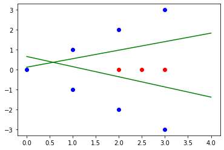
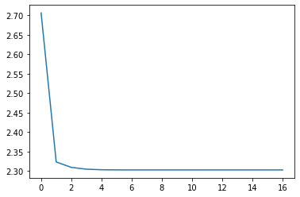

# MLP_Models
Implementation of a **Multi Layer Perceptron** model (both by using scikit-learn library, and from scratch) **MNIST** dataset, and a dataset of **points in the x-y plane** in Python.

<h2>MLP From Scratch:</h2>

Implementation of a multi-layer perceptron model from scratch on different distributions of points in the x-y plane.

The dataset is consisted of several red and blue points with their given coordinates in the x-y plane.

First I put the data in **pandas dataframe** format to make working with it easier. For each point, I put its x and y coordinates in seperated columns as the features. I give the red dots labels of 1 and the blue dots labels of 0.

The dataset is implemented as below:

```ruby
data = {'x':[0, 1, 1, 2, 2, 3, 3, 2, 2.5, 3],
        'y':[0, 1, -1, 2, -2, 3, -3, 0, 0, 0],
        'label':[0, 0, 0, 0, 0, 0, 0, 1, 1, 1]
        }
df = pd.DataFrame(data,columns=['x','y','label'])
```
Next, I split the data into train and test, and implement the **sigmoid** function and its derivative.

The mentioned functions in the code:

```ruby
def sigmoid(x)
def sigmoid_deriv(x)
```

I define the **learning rate** and the **number of nodes** in the input layer and the hidden layer (I put 2 nodes in each layer), and number of epochs as below.

I then define the matrices for weights of each layer. I have a 2x2 matrix for conncetions between the input layer and the hidden layer, and 1x2 matrix for conncetions between the hidden layer and output layer. I initialize the matrices with values from **standard normal distribution**.

I traverse the neural network for the number of epochs I defined.

I first implement **feed forward**: each time, I calculate the output node’s z signal (dot of inputs with wights) and the y signal (sigmoid of z) for each sample.

Then I implement **back propagation** to update the w's for the second and first layers.

Finally, now that I have the updated w's, I test the algorithm with the test data, and calculate the **precision**. As it can be seen in the code, the precision of our model is really good.

The classifying hyperplanes can be plotted using **matplotlib** as below:



<h2>MLP with scikit-learn:</h2>

Implementation of a multi-layer perceptron model on the fashion MNIST dataset, and analysis of different solvers, learning rates, and number of hidden layers on the model.

First, I load the **MNIST** dataset, and split it to **train**, **test** and **validation** sets.

I implement the **mlp classifier** using scikit-learn MLPClassifier, and plot the **loss curve**.

The result is as below:



Next, I implement a **grid search** algorithm by testing the model with different solvers, learning rates, and number of hidden layers, as below:

```ruby
hidden_layers = [1, 2, 3, 4]
layer_nodes = [50, 100, 150]
solvers = ['sgd', 'adam', 'lbfgs']
learning_rate = [0.001, 0.01, 0.1, 0.5, 0.9]
```
